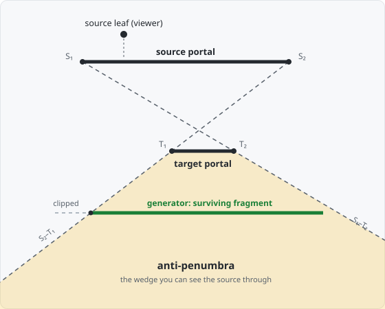

# 03 — PVS (Potentially Visible Set)

**Goal of this stage:** for every leaf, precompute the **set of leaves it could
possibly see** — its PVS. At runtime the renderer draws only the current leaf's
PVS and skips everything else. This is the payoff of the whole project;
everything before it (tree, leaves, portals) existed to make the PVS computable.

Read `00_overview.md`, `01_leaf_tree.md`, and `02_portals.md` first — the PVS is
a flood **through the portals** from stage 2.

---

## 1. What it is

### Visibility as a statement about leaves

Two leaves are **potentially visible** to each other if a straight sightline can
run from somewhere in one to somewhere in the other. Because leaves only touch
through **portals**, that sightline must thread a **chain of portals**:

> Leaf `B` is in leaf `A`'s PVS if there is a chain of portals
> `A → … → B` admitting one straight line that passes through **every** portal
> in the chain.

A leaf always sees **itself** and every **direct neighbour** (one portal away —
a sightline through a single doorway is trivially available). The work is the
*indirect* leaves: can a sightline still thread the second, third, … portal?

### The data

Each leaf's `pvs` becomes a **list of visible leaf indices** (itself included):

```json
"leaves": [ { …, "pvs": [0, 1, 2, 3] } ]
```

Conservative by construction: the PVS may *over*-list (mark a leaf visible that a
finer test would cull) but never *under*-lists — it never hides a leaf that is
actually visible. That is exactly what a render-time cull needs.

---

## 2. How it works

### The flood: leaf → portal → leaf

For each **source leaf** we flood outward through portals:

1. Mark the source leaf visible (it sees itself).
2. For each of its portals, mark the **neighbour** across it visible (direct).
3. From that neighbour, try each of *its other* portals: if a sightline can
   still thread source-portal **and** neighbour-portal, step through into the
   next leaf, mark it visible, and recurse — threading one more portal each step.

The recursion carries a **sight cone** that can only *narrow* as the chain
lengthens; when it clips to nothing, the chain is blocked and that branch stops.

```
recurse_pvs(source_leaf, source_portal, target_portal, target_leaf, pvs):
  generator_leaf = the leaf on the far side of target_portal
  mark generator_leaf visible                 # 2 hops via a convex leaf — always
  for each generator_portal on generator_leaf:
     skip  if generator_portal IS the target_portal        # don't turn back
     cull  if generator_portal lies behind the source portal (source-leaf side)
     cull  if generator_portal lies behind the target portal (target-leaf side)
     generator_portal = clip to anti-penumbra(source_portal, target_portal)
     if empty: skip                                         # cone closed
     source_portal   = clip to anti-penumbra(generator_portal, target_portal)
     if empty: skip
     recurse_pvs(source_leaf, source_portal, generator_portal, generator_leaf, pvs)
```

Clipping *both* the generator and the source portal to the mutual cone each step
is what keeps the cone monotonically narrowing — the chain can only get more
constrained, so the flood terminates.

The two clipped fragments then take different roles as the flood steps outward:
the clipped **generator** becomes the next step's `target_portal` — the aperture
advances one doorway — while the clipped **source** stays the `source_portal`,
still pinned to the origin leaf, only narrower. So the cone's **near end is
anchored at the origin, and its far end marches outward** one portal per step;
the far leaf's own portals become the next generators. The wedge is always
measured between the origin's doorway and the current far doorway.

### The anti-penumbra — and the big 2D collapse

The **anti-penumbra** is the region beyond the target portal reachable by a
sightline passing through **both** the source and target portals — the "light"
that makes it through both slits. It is bounded by **separating lines**: each
passes through one endpoint of the source and one of the target, positioned so
the *whole* source lies on one side and the *whole* target on the other. Because
a portal's endpoints are the **wall corners** flanking its doorway, those two
lines are the shadow edges the corners cast — a sightline can't slip past a
corner without meeting the wall, so anything outside the wedge is blocked. A
generator portal is clipped to the side of each line **away from the source**;
whatever survives is the part still potentially visible. Nothing survives → cull.

This is where 3D collapses dramatically:

| | 3D (the reference) | 2D (here) |
|---|---|---|
| A portal is a… | polygon (quad) | **segment** (2 endpoints) |
| Separating boundaries | a **plane** per source-vertex × target-edge — an **N×M** set | a **line** per source-endpoint × target-endpoint |
| The anti-penumbra | bounded by that whole plane set | a **wedge** bounded by exactly **2 lines** |

For two segments `S₁S₂` and `T₁T₂` the two bounding lines are the **crossed
tangents** — `line(S₁, T₂)` and `line(S₂, T₁)` — the pair that each separate
source from target. The entire 3D plane-set bookkeeping becomes: *find the 2
crossed tangents, clip the generator to the far side of each.* This is the
single biggest simplification of the 2D port.




> **Figure 3.1.** The anti-penumbra of a source portal seen through a target
> portal: a wedge bounded by exactly two crossed-tangent lines, `S₁–T₂` and
> `S₂–T₁`. A generator portal laid across it is clipped to the wedge; the part
> outside is culled, and if nothing survives, that chain stops.

### Worked result on the room

Run against the 4-leaf `room` and **every leaf sees all four** — the PVS is
full. That is correct: you can see *around the corner* of the central obstacle.
A diagonal sightline threads two perpendicular portals — e.g. from `leaf0` (top)
through the `leaf0–leaf1` doorway, across `leaf1`'s corner, through the
`leaf1–leaf2` doorway into `leaf2` (bottom) — so the "opposite" strips really are
mutually visible.

So the room is a **correctness check**, not a culling demo. Good properties to
assert on it:

- **self-inclusion** — every leaf's PVS contains itself;
- **neighbours included** — every portal's two leaves see each other;
- **symmetry** — `B ∈ PVS(A)` ⇔ `A ∈ PVS(B)`.

PVS only *culls* when geometry **occludes**. That needs a scene where standing in
one place genuinely hides distant places — a **maze**. So this stage adds a
`maze` scene: a **serpentine corridor** (a room notched by four alternating wall
teeth), which compiles to a *chain* of leaves. Because the bends break the
line of sight, a leaf's PVS there is a strict subset of all leaves — the far end
of the corridor is culled — and the demo finally shows visibility being thrown
away. The `room` stays as the always-on correctness check.

---

## 3. How we build it

### New code

- **`compiler/pvs.py`** — `calculate_pvs(leaves, portals)` (the per-leaf flood),
  `recurse_pvs(...)`, and `clip_to_anti_penumbra(...)` (the 2-line wedge). It
  reuses `geom2d` throughout: a separating tangent is just a line, a portal is a
  segment, so `classify_wall` / `split_wall` do the clipping.
- A new **`scenes/maze.py`** so the demo has an occluding layout to cull in.

### What this stage writes to `levels/<scene>.json`

- each `leaves[k].pvs` — the sorted list of visible leaf indices (was the empty
  placeholder after stage 2). This is the last field to fill; the seam is now
  complete.

`compile.py` calls `calculate_pvs` after `build_portals`, and `serialize` writes
each leaf's `pvs`.

### A 2D / JSON simplification worth noting

The reference stores each leaf's PVS as a packed **bitset** and run-length-
compresses the zero runs (a memory optimisation for a bit-packed VIS lump). We
store a plain **list of leaf indices** instead — the natural, readable JSON form
at 2D scale. No bitset, no RLE.

### The demo

`demos/03_pvs.html` — pick a point (click / move the cursor); the renderer
`locate`s its leaf and lights that leaf's PVS while dimming the rest. On the
`maze` this visibly culls; on the `room` everything stays lit (the correctness
case). This is the "given a point, which leaves are potentially visible" promised
in the overview.

### Deferred — view-frustum rejection (optional)

The tutorial's 4th topic, **frustum rejection**, narrows the PVS further at
render time to what's inside the camera's field of view. It is a **runtime
render** optimisation, not part of the compiled dataset, so it is optional polish
beyond the "creator + PVS" goal — noted, not built.
