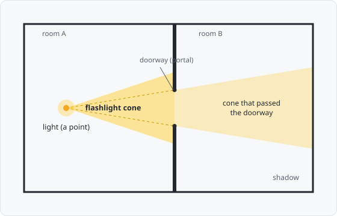

# 04 — Flashlight (bonus)

**A bonus, not a core stage.** The creator is finished at stage 3; this demo
exists to make one point — the precomputed structure is *reusable*. It takes the
stage-3 anti-penumbra and puts it to a completely different job: casting a **2D
light** that spills through doorways and throws shadows.

Read `03_pvs.md` first — the anti-penumbra and the portal flood come from there.

---

## 1. What it is

A **flashlight**: a point light that casts a cone, with light leaking through
doorways into neighbouring rooms and dying out in the far ones.

The observation that makes it almost free: **a point light is a degenerate PVS
source.** The PVS asks *"what can a leaf see through the portals?"*; the
flashlight asks *"what can a point see through the portals?"* — the same question
with the source shrunk to a single point. So the lit region is a visibility
computation, and it reuses the whole stack: `locate` the light's leaf, flood the
portal graph, narrow the cone at each doorway with the anti-penumbra — only now,
instead of ticking a leaf-visible bit, we keep the cone geometry and paint it.

---

## 2. How it works

### The cone through a doorway = a point-source anti-penumbra



> **Figure 4.1.** The light in room A casts a cone. Where the cone meets the
> doorway, only the light between the **rays from the light through the doorway's
> two endpoints** passes into room B — a narrower cone. Everything behind the
> solid wall is shadow.

For a *segment* source (stage 3) the anti-penumbra was a wedge bounded by two
**crossed tangents**. Collapse the source to a single point `P` and it
simplifies: the wedge is bounded by the **two rays from `P` through the doorway's
two endpoints**. That is the slice of light that fits through the doorway — one
endpoint of each tangent has collapsed onto `P`.

### The flood

Same shape as the PVS recursion, but carrying an angular cone `[lo, hi]` from `P`
instead of a set of leaf indices:

```
illuminate(P, aim):
  flood(locate(P), aim − halfAngle, aim + halfAngle, cameFrom = none)

flood(leaf, lo, hi, cameFrom):
  paint(leaf ∩ cone(P, lo, hi))                       # the lit polygon in this room
  for portal in leaf.portals, ≠ cameFrom:
    e1, e2 = the angles from P to the portal's two endpoints
    lo', hi' = max(lo, min(e1, e2)),  min(hi, max(e1, e2))   # narrow by the doorway
    if hi' > lo':
      flood(neighbour(portal), lo', hi', portal)
```

The cone only ever *narrows* (it is an intersection), so — exactly like the PVS —
it terminates. Clipping the convex leaf polygon to the two cone rays gives the
lit shape; a radial gradient from `P` out to the cursor distance fades it, so the
beam has a **reach**.

### The payoff — visibility you can see

An **omnidirectional** light (a full-circle cone) illuminates **exactly the PVS
of its leaf** — the flashlight is a live picture of the set stage 3 precomputed.
Narrow it to a directional cone and the lit set becomes **`cone ∩ PVS`**, which
is literally **`frustum ∩ PVS`** — the view-frustum-rejection topic the overview
deferred, demonstrated here for free.

---

## 3. How we build it

- **No new compiler work.** It reads the committed `levels/maze.json` (tree +
  portals) and is **pure renderer** — the whole point is that the precompute is
  reusable.
- **`demos/04_flashlight.html`** — `locate` (the same tree walk as doc 03), the
  portal flood above, convex-polygon clipping to the two cone rays, and a
  radial-gradient fill over a dark scene.
- **Interaction:** left-click places the light inside a room (a click in solid
  shows a red marker); moving the cursor sets the beam's **aim** (direction) and
  **reach** (distance from the light).
