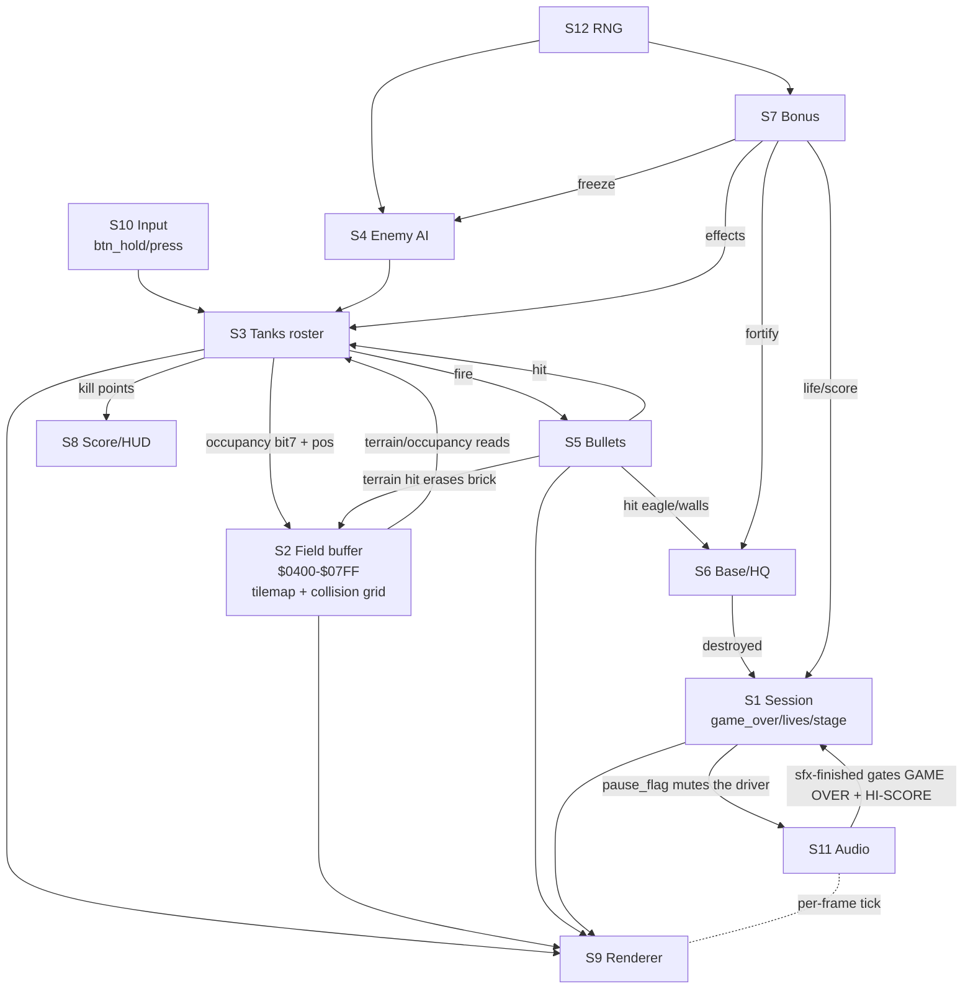

# Battle City — System Interaction Map

*The "big view" for the `tanks_clone` faithful port. Written **before** any
routine porting, per the architecture-first plan. Its job is to describe every
subsystem, how they share state and call each other, and — from that coupling —
propose the JS class decomposition the stub scaffold will follow.*

**Source:** `C:\Z_Temp\NES-Games-Disassembly\Battle City\` (cyneprepou4uk
disassembly). Japanese Namco version, 1985. NROM (mapper 0), one 16 KB PRG bank
`$C000–$FFFF`, one fixed 8 KB CHR ROM. The whole game is `bank_FF.asm`; RAM
labels/xrefs live in `bank_ram.inc`; constants in `bank_val.inc`.

**Citation style:** every claim points at a source label or `$addr`. Lines in
the disasm read `<CDL flags> <fileoffset> <bank:addr>: <bytes> <instruction>`.
I cite by label (`sub_C2E6_main_battle_script`) or CPU address (`$C2E6`).

**Decoded vs inferred:** claims marked **[D]** are read directly from the code.
Claims marked **[?]** are inference (from layout, naming, or BC knowledge) and
must be confirmed before anything is built on them.

**Where a finding lands is decided by its size, not by a schedule.** There is no
one-doc-per-subsystem rule. A few lines go in this map (or as a cited constant +
a code comment, which is often the better home — `constants.js NTSC_FPS`). A real
body of decoded data — a format, a ROM table, a per-site mechanism — earns its own
`research_*.md`. Symmetry is not a reason to create a file; a doc that restates a
map section is worse than no doc.

---

## 1. The two-halves frame model

The game is a single cooperative loop synced to the PPU by one interrupt. There
is no scheduler and no IRQ (`$FFFE → $C070`, "this game doesn't use IRQ").

- **Main-loop half (logic).** Runs continuously, builds two output buffers in
  RAM during the frame:
  - `ram_oam` at **`$0200–$02FF`** — the sprite/OAM shadow (DMA source).
  - a **PPU write buffer** — queued nametable/tile updates, flushed in vblank.
  Then it calls `sub_D8F6_wait_1_frm` (`$D8F6`) which spins until the NMI has
  fired, i.e. one iteration = one frame.
- **NMI half (render + I/O), `vec_D400_NMI` (`$D400`).** Fires at vblank and does
  all hardware talk, in order **[D]**:
  1. OAM DMA: `$2003=0`, `$4014 = >ram_oam` (page `$02`).
  2. `$2002` read (ack vblank) → `sub_D8FD_write_buffer_to_ppu` (flush tile buffer).
  3. `sub_D50E_set_background_palette` if `ram_bg_palette_id` ≥ 0.
  4. Set `$2000` (base nametable | `$B0`), scroll X=0 / Y=`ram_scroll_Y`, `$2001=$1E` (rendering on).
  5. `sub_D689_read_joy_regs` — **input is sampled here**, into `ram_btn_hold`/`ram_btn_press`.
  6. `sub_DA93_hide_unused_sprites` — clear stale OAM.
  7. `sub_EA7E_sound_driver` — **the sound engine ticks once per frame here**.
  8. `INC ram_frm_cnt_lo` (and `ram_frm_cnt_hi` every 64 frames).

**The rate is hardware, not a choice [D].** Nothing in the ROM sets a frame rate —
the PPU's vblank NMI *is* the clock, and the main loop only sleeps on it. Famicom
⇒ **NTSC, 60.0988 Hz**. `bra_C1F9_loop` calls `wait_1_frm` exactly **once** per
pass, so *one logic pass = one frame*.

**`ram_frm_cnt_hi` is not a high byte [D].** `$D43E` does `AND #$3F / BNE / INC`,
so it ticks every **64** frames — the pair is a frame counter plus a coarse
64-frame counter, not a 16-bit value. Both are load-bearing: the RNG mixes
`frm_cnt_hi` in (`$D45A`), and the game *writes* it as a timer (`$C236` seeds
`#$FE`, `$C24D` waits for `#$02` ⇒ 4 hi-ticks = 256 frames ≈ 4.3 s). A JS port
that collapses them into one counter breaks both. → `constants.js NTSC_FPS`.

**Port consequence.** In JS the NMI half mostly *dissolves*: OAM DMA + PPU-buffer
flush are hardware plumbing. We keep the *responsibilities* (sample input once
per frame, tick audio once per frame, advance the frame counter, then draw), but
re-express them as a `requestAnimationFrame` tick, not a literal buffer flush.
This is the sanctioned "re-derive the hardware abstraction in our own view"
deviation — the mechanism (logic builds state, render ships it) is preserved.
**rAF is the render pump only** — it runs at the *display* rate (60/120/144), not
60.0988, so logic needs a fixed-timestep accumulator against `NTSC_FPS`. (Pattern:
`block_stacker/main.js`; live example: `demo/level_viewer.js`.)

---

## 2. Top-level flow

**→ The screen-level flow is decoded in full in `research_game_flow.md`** — 11
phases, the `PLA/PLA` transition mechanism, the gate variables, the endless
70-stage cycle. This section keeps only the shape the rest of *this* map needs.

```
vec_C070_RESET
  └─ init PPU, clear RAM, palettes
  └─ title-screen + demo loop  (loc_C095 … loc_C0A2)
        ├─ sub_C9C0_title_screen_handler   (I / II player select cursor)
        ├─ sub_C41D_demo_handler           (attract-mode auto-play — reuses the battle loop)
        └─ loc_C0AE_construction_handler   (built-in stage editor)
  └─ game-mode dispatch  tbl_CA69_game_mode_handler
        ├─ 00 → 1 player      (enemy_limit = con_max_tanks-2 = 5)  ┐ both → JMP loc_C159
        ├─ 01 → 2 players     (enemy_limit = con_max_tanks   = 7)  ┘ (the SAME loop)
        └─ 02 → construction
  └─ STAGE LOOP — the gameplay heartbeat, bra_C1F9_loop [D]:
        bra_C1F9_loop:
          JSR sub_D8F6_wait_1_frm           ; sync to NMI — ONCE, at the TOP
          LDA ram_pause_flag / BNE ---------┐  ; pause gates ONLY the pipeline
          JSR sub_C2E6_main_battle_script   ; │ LOGIC pipeline (§3)
        bra_C203_game_is_paused: <----------┘
          JSR sub_E23B_display_bonus_on_screen
          JSR sub_E0D8_bullets_status_handler
          JSR sub_DEA6_tanks_handler        ; DRAW all 8 tanks (state machine, §4)
          ... Start-button pause toggle, sub_C8F9_display_pause_text ...
          JSR sub_C728_check_condition_for_stage_ending   ; Z=0 ⇒ leave the loop
        bra_C238_loop:                      ; the ENDING TAIL — still the battle,
          ... sub_C2A2_disable_buttons_if_game_over       ; buttons off if game over,
          JSR sub_C2E6_main_battle_script   ; runs on for 128 frm (256 if GAME OVER slides)
```

`sub_C2E6_main_battle_script` has **exactly three call sites [D]**: the battle
loop (`$C200`), the **ending tail** (`$C23E`) and the demo loop (`$C429`) — the
demo/attract mode is literally the same loop with AI driving the "players."

Three things the shape above makes explicit, all easy to get wrong:

- **The wait is at the TOP, not the bottom** — the pass is *sleep, then do a
  frame's work*, so one `wait_1_frm` per iteration ⇒ 60.0988 Hz logic (§1).
- **There is no separate 2P loop.** 1P and 2P share `loc_C159` entirely; the mode
  handlers (`$CA6F`/`$CA74`) differ only in `ram_enemy_limit` (5 vs 7) before both
  `JMP loc_C159`, plus a spawn-interval tweak (`$C3AD` subtracts `#$14` in 2P).
  *(Corrected 2026-07-16: this section previously called `$C23E` "the 2P loop." It
  is the stage-ending tail loop. Game flow doc §2/§3c.)*
- **Pause (`$C1FC`) gates only `sub_C2E6` — within the stage loop.** `$E23B` /
  `$E0D8` / `$DEA6` keep running while paused, which is why sprites still animate
  on the pause screen; a port that freezes everything on pause is wrong. But
  `ram_pause_flag` has a **second consumer outside this loop**: `sub_EA7E_sound_driver`
  reads it (`$EA7E`) and mutes every sfx slot but the pause tone. Game flow doc §6e.

`sub_C331_prepare_tanks_addresses_and_spawn_players_before_stage` (`$C331`) is
the **stage-entry reset**: clears bullets/tanks, spawns surviving players,
seeds the enemy counters (`ram_enemy_spawn_cnt=$14`=20 enemies/stage),
clears power-up timers, draws the 20 enemy icons, and calls
`sub_E42B_prepare_enemy_tanks_for_stage` **[D]**.

---

## 3. The per-frame battle pipeline (the heart)

`sub_C2E6_main_battle_script` runs these **in this exact order** every frame
**[D]**. The order is a **faithfulness invariant** — even though the OO port
reorganizes the *data*, `mainBattleScript()` must call the subsystems in this
sequence, or behavior drifts (e.g. collisions must run after movement).

| # | Routine (`$addr`) | What it does | Reads | Writes |
|---|---|---|---|---|
| 1 | `sub_E181_ice_detection` (`E181`) | Each tank's pixel pos → field cell; detect ice under players; **mark 2×2 occupancy bit7** in field | tank pos, field `$0400+` | `tank_stage_pos_lo/hi`, `plr_flags` (ice bit7), field bit7 |
| 2 | `sub_DB75_ice_movement` (`DB75`) | Apply ice sliding to tanks flagged on ice | `plr_flags`, tank pos | tank pos |
| 3 | `sub_DBF1_tank_movement` (`DBF1`) | Move every tank: players by input, enemies by AI; terrain-blocked via field | input, tank dir/flags, field | tank pos, tank flags (dir) |
| 4 | `sub_E1FA` (`E1FA`) | **Tank→field occupancy writeback** — set bit7 for each tank's cell footprint (post-move) | tank_stage_pos, field | field bit7 |
| 5 | `sub_E02E_bullets_status_handler` (`E02E`) | Advance bullet lifecycle/status per tank | bullet_status | bullet_status |
| 6 | `sub_E2A9_HQ_handler` (`E2A9`) | Eagle/base: draw, shovel-fortify walls, detect destruction → game over | shovel_timer, field | field, game_over_flag |
| 7 | `sub_E27C_players_invincibility_handler` (`E27C`) | Star/helmet invincibility timers + blink | helmet_timer | tank flags/render |
| 8 | `sub_E122` (`E122`) | **Player fire** — A/B → spawn bullet; 2-bullet upgrade promotes shot to `2nd_bullet` slot | btn_press, tank_type, bullet arrays | bullet arrays (`E08C`) |
| 9 | `sub_E162` (`E162`) | **Enemy fire** — frozen if `clock_timer`≠0; else 1/32 RNG roll per enemy → spawn bullet | clock_timer, tank flags, RNG | bullet arrays (`E08C`) |
| 10 | `sub_DB48_enemy_spawn_handler` (`DB48`) | Spawn next enemy when slot free + interval elapsed | spawn counters, timers | tank slot 2–7 |
| 11 | `sub_E604_bullets_movement` (`E604`) | Move all bullets; terrain collision via field (brick/steel/water) | bullet arrays, field | bullet pos/status, field (brick erase) |
| 12 | `sub_E910_check_bullets_collision_with_bullets` (`E910`) | Bullet-vs-bullet cancellation | bullet arrays | bullet_status |
| 13 | `sub_E70C_check_bullets_collision_with_player_tanks` (`E70C`) | Bullet-vs-tank hits (and enemy bullets vs players) | bullet arrays, tank arrays | tank flags (→explode), score |
| 14 | `sub_E972_try_to_pick_up_bonus` (`E972`) | Player over bonus → apply power-up effect | bonus pos/id, tank pos | bonus, timers, lives, score |
| 15 | `sub_C972_game_over_text_handler` (`C972`) | Slide in GAME OVER when `game_over_flag` set | game_over_flag | render |
| 16 | `sub_DB0B_player_movement_sfx_handler` (`DB0B`) | Engine SFX from whether players are moving | tank move state | sfx regs |
| 17 | `sub_C7C8_print_lives_handler` (`C7C8`) | Lives HUD | lives | PPU buffer |
| 18 | `sub_C31D_water_palette_swap_handler` (`C31D`) | Animate water: swap bg palette every 32 frames | frm_cnt | bg_palette_id |

Note the missing draw step: `sub_DEA6_tanks_handler` (drawing the 8 tanks) is
**not** in this list — it's the *second* call in the stage loop (§2), right after
this pipeline. So this routine is purely "advance world state"; tank drawing is
its own pass.

---

## 4. The tank state machine (dispatch mechanism)

`sub_DEA6_tanks_handler` (`$DEA6`) loops `X = 0..7` calling
`sub_DEB8_tank_handler` per slot **[D]**. `tank_handler` dispatches on the **high
nibble of `ram_tank_flags,X`** through a jump table:

```
tank_handler:  A = tank_flags[X];  Y = (A >> 3) & $FE       ; nibble → word index
               JMP (tbl_E4B8_tank_status_handler + Y)
```

So `ram_tank_flags` packs **state (high nibble) + direction (low nibble)** in one
byte, and the state drives a vectored jump — the cleanest possible thing to port
as method dispatch (a `switch(state)` or a per-state method on `Tank`). Known
states from `bank_val.inc` + the handlers at `$DECD…` **[D]**:

| flags hi | handler | meaning |
|---|---|---|
| `$10` | `ofs_001_DEFD_10_kill_points` | show points popup after a kill |
| `$20`/`$30`/`$40` | `ofs_001_DF33/DF46_..._explosion` | multi-frame explosion animation |
| `$50`/`$60`/`$70` | `ofs_001_DECD_..._explosion` | explosion (con_tank_flag_explosion=`$70`) |
| `$80`–`$A0` | normal active states | alive/driving |
| `$B0`/`$C0`/`$D0` | (con_tank_flag_follow_HQ/p2/p1) | **enemy AI target bias** |
| `$E0` | — | (guard band: `≥$E0` treated as respawning) |
| `$F0` | con_tank_flag_respawn | spawning/blink-in |

The pipeline routines gate on this constantly with the same idiom **[D]**:
`BPL` (bit7 clear) = "exploding/inactive, skip"; `CMP #$E0 / BCS` = "respawning,
skip". So "is this tank live and drivable?" = `flags ≥ $80 && flags < $E0`.

---

## 5. Subsystem catalog

Each subsystem, its role, the state it owns, and its main routines. This is the
raw material the §7 decomposition groups into classes.

**S1 — Session / mode / stage flow.** Owns `ram_game_mode`, `ram_stage`,
`ram_lives` (2), `ram_game_over_flag`, `ram_2nd_loop_flag`, per-player scores.
Routines: reset, `tbl_CA69` mode dispatch, the stage loops, `C331` stage prep,
`C728_check_condition_for_stage_ending`, `CCD4_score_after_stage_handler`.

**S2 — Field / battlefield.** *The central shared structure.* The **field buffer
`$0400–$07FF`** mirrors a **whole nametable** [D]: `$0400–$07BF` = 960 tile IDs
(32×30) carrying bit7 occupancy, `$07C0–$07FF` = the 64-byte **attribute table**
(`ram_nmt_attr_buffer`), exactly like `$2000–$23FF`. Routines: `F000_draw_stage`,
`D80B_write_block_tiles_and_attribute_to_buffer`, `E181` (ice + occupancy),
`E1FA` (occupancy writeback), `D706/D709/D713` (pixel→cell pointer),
`CC27_copy_nametable_attributes_to_ppu_buffer`. Terrain collision for tanks and
bullets is *reads of this buffer*.

**Resolved 2026-07-18 — `Field` HAS-A `Tilemap`; the tile ids ARE the terrain state
[D].** The "one thing or two?" question (old §8 `[?]`) is settled. The `$0400` buffer
is a general **background surface** — the title (`$D17F`) and GAME OVER (`$C5D9`) draw
into a bare `Tilemap`, so the buffer is *not itself* `Field`. But terrain also cannot
be lifted into a separate 13×13 block grid: a bullet chips a brick to a **4×4 quadrant
mask** (`sub_D743` writes `(~quadbit) & tile` back), which only the tile id can hold —
a block code (`$0-$D`) has no representation for "brick missing its top-left corner".
So the **tile bytes ARE the terrain**, and `Field` *wraps* a `Tilemap` (the P4 render
class) and adds the semantics — `loadStage`, pixel→cell, terrain queries. Two hardware
artifacts are re-derived out under the governing test (faithful to observable terrain
shape + cell colour; free with CPU-only packing):
- **bit7 occupancy**, packed into the tile byte only to save RAM (`sub_E1F3` sets,
  `sub_E234` clears), → a **separate occupancy grid**. P5 kept the two-pass *timing*
  (`$E181` marks all footprints → `$DBF1` moves → `$E1FA` clears, §3) as a faithful
  rule, since marking every tank before any moves is player-observable.
- the **packed 64-byte attribute table** → a **1:1 palette-per-cell array** on
  `Tilemap`, render-only and *not* `Field`'s data. In Battle City one block = one
  attribute quadrant = one palette, so per-cell resolution loses nothing.

The Field mechanism itself — the (2,2)/26×26 geometry, the `$F000`/`$D7CC`/`$D80B`
decode, `pixelToCell` = `$D706`, and the `$E181`/`$E1FA` occupancy footprint — is
built and documented in **`docs/research_field.md`** (P5). This map stays at the
coupling level.

**Two namespaces — do not mix them [D].** This is the trap:

| | what it is | where it lives |
|---|---|---|
| **BLOCK code** `$0–$D` | one nibble per 16×16 block | `incbin/stages/*.bin` |
| **TILE id** | 2×2 per block, what collision reads back | the field buffer |

A stage decodes BLOCK → 4 TILEs at draw time; gameplay then reads TILEs
(`E181` compares tile `$21` for ice; `DA2B` compares tile `$22` for forest;
`con_block_type` = `$00`). Geometry (closes the old §8 `[?]`): **13×13 blocks of
16×16 px** = 208×208, each block 2×2 tiles of 8×8 ⇒ 26×26 quarters.

**The default fill: `$11` is the border, `$00` is empty — they are different
layers, not a contradiction [D].** `sub_D7CC_create_default_stage_field` (`$D7CC`,
via `sub_C9B0`) does three things in a row, and reading only the first is what made
this look like a puzzle:

| | what | source comment |
|---|---|---|
| `$D7CC-$D7DD` | fill **all** of `$0400–$07FF` with tile **`$11`** | *"fill all stage will undestructable grey tile"* |
| `$D7DF-$D7E7` | clear `$07C0–$07FF` (the attribute table) to `$00` | *"clear nametable"* / *"clear 07C0-07FF"* |
| `$D7F4-…` | clear the **26×26 play grid** back to `$00` | *"clear 26x26 grid (decimal)"* |

So `$11` is the **grey border surrounding the play field**, and `tbl_DACB`'s
"empty = `$00`" applies *inside* the 26×26 grid the third loop carves back out.
`sub_F000_draw_stage` then paints the stage into that grid. `$11` is reused as the
curtain tile (`sub_CC90_close_grey_curtain`, `$CC90`: `LDA #$11 ; grey tile`) and
as `" "` in text (`sub_CA91`, `$CAC7`) — one tile id whose colour follows its
attribute quad, exactly per S9's "BG text has no palette of its own."
**Do not confuse it with `sub_D47E_clear_0400_07FF`** (`$D47E`), a *different*
routine that fills the same range with `$00`, used by the text screens
(`sub_D16A`, `sub_D17F`, `sub_C5D9`, `sub_C44B`, `sub_C295`).
*(Resolved 2026-07-16; was a §8 `[?]`.)*

**Stage format [D]** — 91 bytes = 182 nibbles = **14 cols × 13 rows**, high-nibble
first; column 13 is padding (`$D` in all 468 rows across all 36 files) ⇒ 13×13
usable. `sub_F000_draw_stage` confirms the stride itself (`LDA #$5B` = 91) and
dispatches `A = $FF` → the demo stage; `A ≥ $24` → `SBC #$23` (the 2nd-loop wrap).
Verified against the legacy `../tanks/dat_levels.js` layouts.

**Block → tiles + palette [D]** — one code drives *two* tables, both read by
`sub_D80B`: `tbl_DACB_block_data` (`$DACB`, code×4 → TL,TR,BL,BR tile ids) and
`tbl_DABB_nametable_attribute` (`$DABB`, code → BG palette 0–3). Brick→pal 0,
steel/ice→3, water→1, forest→2. `$E`/`$F` unused. Values live in `constants.js`
(`BLOCK` / `TILE`) and `assets/dat_chr.js`; this map stays at the coupling level.

**The eagle is NOT in stage data [D]** — row 12 is empty in every stage file; the
HQ and its walls are painted by code (`$C331` / `$E2A9`, which also hand-write
attribute offsets `$33`/`$34`). That belongs to S6, not the stage format.

**S3 — Tanks (roster).** 8 parallel arrays, `X = slot`: `tank_pos_X`($90),
`_pos_Y`($98), `_flags`($A0), `_type`($A8), `_wheels`($B0),
`tank_stage_pos_lo/hi`($E0/$E8). **Slot 0=P1, 1=P2, 2–7=enemies** **[D]**.
Routines: `DEA6`/`DEB8` (draw+state), `DC3D_tank_status_handler`,
`DBF1_tank_movement`, `DB75_ice_movement`, `E363_tank_spawn_handler`,
`DB48_enemy_spawn_handler`, `E42B_prepare_enemy_tanks_for_stage`,
`E27C_players_invincibility_handler`, `E420_change_tank_status`.
**Player movement ported P6; the enemy spawn machinery (`DB48`/`E42B`/`E363`/`E3B8`)
ported P9** — `docs/research_enemy_ai.md §5`.

**S4 — Enemy AI.** Not a separate routine block — woven into S3. Targeting bias
lives in the `tank_flags` nibble (`$B0/$C0/$D0` follow HQ/p2/p1); movement
decisions in `DBF1_tank_movement` using `D44D` RNG and
`ram_enemy_destination_X/Y`; firing in `E162` (1/32 roll). **Ported P9** (movement
only — fire is P10): the state machine (`$80`/`$90`/`$A0` + the follow states) is the
enemy movement, so the port keeps the shared step on `Tank` and the decisions on a
stateless `EnemyAI`; target selection drifts wander→player→HQ (`sub_DE72`) with a
biased direction chooser (`sub_DDA2` + `tbl_E486`). Enemy **types/counts** per stage
are decoded: `ram_enemy_type_stage_cnt` ($8B, 4 bytes) = the *counts* of the 4 type-
slots (`tbl_E578`, summing to 20), and `tbl_E4EC` = their type bytes ($80 basic / $A0
fast / $C0 power / $E0 armour). Full decode: `docs/research_enemy_ai.md`.
*(Resolved 2026-07-19: two §8 [?] items — the "4 types per stage" question, and the full
`tank_type` bit-layout. The layout: the enemy type bytes here + the 2-bullet gate
(`$C0==$40`) in S5, the bonus flag (`$04`) in S7, the armour damage-DEC (`$E3→$E2`) in
`research_enemy_combat.md`, the player star tiers (`$20/$40/$60`) in `research_bonus.md` §5;
canonical in `constants.js` `TANK_TYPE`.)*

**S5 — Bullets.** Per-tank arrays (8 wide) + 2nd bullet (players only, 2 wide)
**[D]**: `bullet_pos_X`($B8)/`_Y`($C2), `bullet_status`($CC),
`bullet_property`($D6); `2nd_*` at `$C0/$CA/$D4/$DE`. Routines: `E08C_bullets`
(spawn), `E02E_bullets_status_handler`, `E604_bullets_movement`,
`E70C` (vs tanks), `E910` (vs bullets), terrain hit inside `E604`,
`DEE2_draw_bullet_explosion`, `E409_clear_bullet_status`.
**Ported P7** — the three-handler split (§8's old `[?]`) is resolved: `E02E` (step 5)
advances flying bullets + counts the explosion down; `E604` (step 11) moves + does the
terrain collision (`E69A`); `E0D8` is the separate **render** half. Full decode +
citations + the packed-`status`-byte split: `docs/research_bullets.md`.

**S6 — Base / HQ (eagle).** `E2A9_HQ_handler`, `ram_shovel_timer`($45) fortify,
eagle draw routines (`CAF5`/`CB5D`/`CB9E`/`CC08`), destruction → sets
`game_over_flag`. Reads/writes S2 field (the walls around the eagle).
**Ported P8** — the base is field TILES (walls `$0F`/`$10`, eagle `$C8-$CB`, destroyed
`$CC-$CF`), only the game-over explosion is sprites; the eagle-hit → 39-frame countdown →
game over is now live, and `sub_E2A9`'s shovel branch is wired to the shovel bonus (P14). This also
exposed + fixed a latent `isPassable` bug (`$DCD5 BMI`; the eagle would let tanks through).
Full decode: `docs/research_base.md`.

**S7 — Bonus / power-ups.** `ram_bonus_pos_X/Y/id`($86/$87/$88),
`ram_bonus_timer`($62). Routines: `E8BE_spawn_bonus`, `E23B_display_bonus_on_screen`,
`E972_try_to_pick_up_bonus`, `E902_convert_random_number_to_position`.
**Ported P14.** A bonus-carrier enemy (4th/11th/18th, `TANK_TYPE.BONUS_FLAG`) drops a
power-up when killed (`$E7D7`); a player driving over it gets 500 pts + one of **7
effects** (`tbl_E9E2`): 0 helmet ($89), 1 clock/freeze ($0100 → gates S4 move+fire),
2 shovel (S6 `Base.applyShovel`), 3 star (upgrade → S5 bullet FAST/POWER/2-shot),
4 grenade (explode all enemies, no score), 5 tank (extra life), 6 pistol (no-op, never
spawned). Spawn picks a 4×4-grid position off any player + a weighted-random id (grenade
& star 2/8 each). The **star lifecycle** spans S3/S5: `tank_upgrade`($0101) persists the
tier across stages, zeroed on death (`$E76A`), restored on respawn (`$E3C5`). The
clock-freeze **countdown** (`$DBFA-$DC00`) and the dormant P8 shovel / P9-P10 freeze gates
went live here. Full decode: `docs/research_bonus.md`.
*(Resolved 2026-07-19; the "which power-ups exist + their `bonus_id` values" [?] was a §8 item.)*

**S8 — Score / HUD.** BCD scores `p1_score`($15)/`p2_score`($1D)/`hi_score`($3D),
`com_dec_*` digit fields ($35–$3B). Routines: `D9BE_add_score`,
`D138_gain_extra_life_for_20000_pts`, `D97D_check_hiscore_beaten`,
`C7C8_print_lives_handler`, enemy-icon counter (`C894/C8A2/C8B1/C8C0`),
`CEF7_draw_screen_with_score_count`.

**S9 — Renderer (PPU abstraction).** OAM shadow `$0200`, PPU write buffer,
palettes (`tbl_D555`/`tbl_D565`, `D50E`/`D53E`), scroll `ram_scroll_Y`.
Routines: NMI half, `DA2B_display_sprite`, `DA7B_display_2_sprites`,
`DA93_hide_unused_sprites`, `D8FD_write_buffer_to_ppu`, `D6B3_fill_buffer_with_tiles`,
`D85E`/`D8D2` "huge letter" text, `D771_write_to_ppu`.

CHR/OAM facts, all from `$2000 = ram_base_nmt | $B0` (`$D41F`) **[D]**: bit 4 ⇒
**BG pattern table at `$1000`** (tiles 256–511), bit 3 ⇒ sprites at `$0000`, bit 5
⇒ **8×16 sprite mode** (a 16×16 tank is 2 sprites, not 4). *Caveat:* in 8×16 mode
bit 3 is ignored — the OAM tile byte's own bit 0 picks the table, so sprites do
draw from the BG table (`$C59C` loads `#$9D`). The two tables are not "sprites"
and "tiles". The sprite table is essentially all tanks; the BG table is terrain
**plus the whole text system** (alphabet, digits, PAUSE/STAGE/GAME OVER, `namcot`).

**Sprite palette = who you are [D].** `$DFB6` splits on `CPX #$02`. Players:
`$DFE8` is just `TXA` — the tank's **slot index IS its palette** (0 = P1 yellow,
1 = P2 green); stunned players blink on `frm_cnt_lo & $08`. Enemies:
`tbl_E003[((frm_cnt_lo*4) + tank_type) & 7]` = `{2,0,0,1,2,1,2,2}`, so most enemy
types **flicker between two palettes every frame** (deliberate CRT blending; only
type 0 is constant). A bonus tank (`tank_type & $04`, `$DFBA`) flashes palette
**2↔3** every 8 frames. Palette 3 is also the sprite-text palette (`$C947` GAME
OVER, `$C8FD` PAUSE, blinking on `& $10`).

**BG text has no palette of its own [D].** `sub_D612` is the *only* per-item
attribute writer and has exactly one caller — `$D81E`, inside `sub_D80B`. So text
inherits the palette of the 32×32 attribute quad it lands in. Default is
**palette 0** (`$D7E1` clears the whole `$07C0` shadow to `$00`); screens then
hand-write regions (`sub_D0D9` for the score screen; the eagle for `$33`/`$34`).

**`sub_DA2B` is not plumbing — it reads the field [D].** Before writing OAM it
probes the field at *this sprite's own* `(x+3, y)`; if the tile is `$22` (forest)
it OR's in the priority bit, i.e. the sprite draws *behind* the background — the
tanks-hide-under-trees mechanic. It **writes the result back** into
`spr_A_palette`, and `sub_DA7B` never resets it between the two halves, so if
either half is on forest **both** go behind. That "hide as a unit" behaviour is an
emergent side effect of the two-call structure — a port must draw 2×8×16 and not
pre-compose a 16×16 bitmap, or the rule has to be hand-guessed (and the obvious
guesses are wrong). This is a screen-RAM readback, but a **free** one: `Field` is
already a real array in §7, so it ports as a plain read with no substitute — an
argument *for* the locked routine-level architecture.

**S10 — Input.** `D689_read_joy_regs` (in NMI) → `ram_btn_hold`($06),
`ram_btn_press`($08), 2 bytes each (P1/P2). `E451_convert_Dpad_buttons`
(Dpad → facing direction). Constants `con_btn_*` in `bank_val.inc`.

**S11 — Audio.** Bytecode sound engine: `EA7E_sound_driver` (ticked in NMI)
interprets control bytes (`con_se_cb_*`: loops/stop/main-loop) from sfx data
streams (`_off000_sfx_*` table at `$ED..`). This is *ported code*, not analog
hardware — fully portable. Deferred at scaffold time, **ported in P15**
(`audio.js` + `assets/dat_sfx.js`; decode + verdicts in `research_audio.md`).

**Audio is not purely an output — it gates two phase transitions and reads the
pause flag [D].** Two corrections to the "passive per-frame tick" framing:

- **The GAME OVER and HI-SCORE screens are timed by the sfx, not a frame counter.**
  `$C630` spins on `ram_sfx_game_over_1`, `$C495` on `ram_sfx_hiscore_1`, both
  commented *"wait until sound is played"*. While `Audio` was a stub these two screens
  needed a substitute duration; since P15 they wait on the real
  `audio.isPlaying(...)`. (GAME OVER has a Start/Select escape at `$C627`; HI-SCORE
  has none.)
- **`sub_EA7E` reads `ram_pause_flag` (`$EA7E`)** and drops `ram_sfx_check_limit`
  from `$1C` (all slots `$0300-$031B`) to `$01` (the pause tone only) — i.e. the
  driver mutes itself. That is how the demo is silent (`$C3B7`).

Detail: `research_game_flow.md` §6d/§6e.

**S12 — RNG.** `D44D_generate_random_number`: `random = random*7 + frm_cnt_hi +
zp[++index]` **[D]**. Consumed by S4 (movement, fire), S7 (bonus pos), spawn.
**Ported P9** — the `zp[++index]` stir is live game state (an entropy source the port
does not reconstruct); re-derived as a 16-bit LFSR + `frm_cnt_hi`, which is
reproducible (so movement tests are deterministic). `docs/research_enemy_ai.md §1`.

**S13 — Construction (stage editor).** `loc_C0AE_construction_handler` + cursor
movement + block paste. Ships in the retail ROM. Deferral candidate (not core
gameplay). *(Corrected: `stage_FF.bin` is **not** this — it is the **demo/attract**
stage. `sub_F000_draw_stage`'s own header says "FF = demo stage" and dispatches
`CMP #$FF` → entry 36; `bank_FF.asm:8670` comments the `.incbin` `; demo`. What,
if anything, the editor loads by default is unverified.)*

---

## 6. Coupling — the shared-state graph

The subsystems are coupled almost entirely through **five shared data
structures**. This is what the OO decomposition must respect.



**Audio is not a leaf [D].** The dotted per-frame tick is the *obvious* edge; the
two solid ones are the ones a port forgets. `$C630`/`$C495` block a phase
transition on the sfx finishing, and `$EA7E` reads `ram_pause_flag`. See S11.

**The five shared structures:**

1. **Field buffer (S2)** — the biggest coupler. It is *simultaneously* the
   tilemap (what's drawn) and the collision grid (bit7 occupancy + tile-type
   terrain). Tank movement, bullet-terrain collision, base walls, and occupancy
   all read/write it. In OO this becomes a central `Field` service that most
   other objects query.
2. **Tank roster (S3)** — read by nearly everyone (collision, AI, bonus, render).
3. **Bullet arrays (S5)** — indexed parallel to tanks (bullet *i* is tank *i*'s).
4. **Session state (S1)** — `game_over_flag`, `lives`, `stage`, scores.
5. **Frame/RNG/input primitives (S10/S12 + `frm_cnt`)** — cross-cutting inputs.

**Ordering couplings (must preserve, §3):** ice-detect → move → occupancy →
fire → spawn → bullet-move → collisions → bonus. Reordering changes behavior.

---

## 7. JS decomposition (idiomatic OO) — **LOCKED 2026-07-15**

Derived from §6, honoring the chosen style: **idiomatic OO, faithful behavior,
data reorganized** (not a zero-page mirror). Each class notes the source routines
it will absorb. Boundaries follow the coupling graph, so a class rarely reaches
into another's data except through the `Field` service (which is *meant* to be
shared). **Locked per Zane 2026-07-15:** build the classes as proposed; if a
boundary proves wrong during implementation, revise then — don't block the
scaffold on it. `Audio` and `Construction` started **stub-only (deferred, low
priority)** — `Audio` was **ported in P15**; `Construction` is still a stub.
The §8 `[?]` items were resolved during implementation / in the
per-subsystem docs, not before scaffolding (§8 is now empty).

| JS module / class | Responsibility | Absorbs (source) |
|---|---|---|
| `Game` | **the phase machine** (11 phases, flow doc §1), mode dispatch, stage loop, `update()` calling subsystems in the §3 order, session state (lives/stage/score/gameOver) | reset, `tbl_CA69`, stage loops, `C331`, `C728`, `CCD4`, `C5D9`, `C44B` |
| `Field` | tilemap + collision grid service; terrain types; block data; draw; pixel→cell; occupancy bit7; terrain queries | `F000`, `tbl_DACB`, `D80B`, `E181`, `E1FA`, `D706/D713` |
| `Tank` | one tank: pos/dir/type/state(`flags`)/wheels; movement; the state-machine dispatch; per-tank render state | `DEB8`, `DC3D`, `DBF1`, `DB75`, tank-status handlers `DECD…` |
| `TankRoster` | the 8 slots (0=P1,1=P2,2–7 enemies); the `DEA6` loop; spawn scheduling; invincibility; player/enemy distinction | `DEA6`, `E363`, `DB48`, `E42B`, `E27C` |
| `EnemyAI` | targeting bias (follow HQ/p1/p2), destination pathing, fire decision; delegated to by enemy `Tank`s | `DBF1` (AI paths), `E162`, `ram_enemy_destination_*` |
| `Bullet` / `BulletManager` | per-tank + 2nd-bullet lifecycle; fire; movement; the 3 collision passes; explosion | `E08C`, `E122`, `E02E`, `E604`, `E70C`, `E910`, `DEE2` |
| `Base` | eagle state, shovel fortify walls, destruction → gameOver | `E2A9`, eagle draws, `shovel_timer` |
| `Bonus` | spawn/display/pickup + effect application (helmet/clock/shovel/grenade/tank/star) | `E8BE`, `E23B`, `E972`, `E902` |
| `Score` / `Hud` | BCD score, extra-life, hi-score, lives + enemy-icon HUD | `D9BE`, `D138`, `D97D`, `C7C8`, icon counters |
| `Renderer` | canvas draw of field + sprites + text + palettes; the re-derived "NMI render" responsibilities | NMI half, `DA2B`/`DA7B`, palettes, `D8FD`, huge-text |
| `Input` | joypad state (hold/press, 2 players) + Dpad→direction | `D689`, `E451` |
| `Audio` | bytecode sfx engine (**built, P15**) | `EA7E` + sfx data |
| `Rng` | the `D44D` mixer | `D44D` |
| `Construction` | stage editor (deferral candidate) | `C0AE` + cursor/paste |

**Design notes for the port:**
- `Field` is deliberately a *shared service*, not owned by one entity — that
  matches the source, where the field buffer is the universal collision medium.
  The alternative (hiding cells inside `Tank`/`Bullet`) would fight the source.
- The **§3 pipeline order** becomes the body of `mainBattleScript()`. Keep it literal.
- The **`tank_flags` state machine** becomes a `Tank` state enum + per-state
  handler (mirrors the `tbl_E4B8` jump table).
- **`Game` is a mode machine — 5 modes, one nesting level. LOCKED; see flow doc §7.**
  The source has no screen state variable and no dispatcher (unlike the `tank_flags`
  machine): each phase is a subroutine owning a `wait_1_frm` loop, and the
  non-linear transitions pop the return address off the stack (`PLA/PLA`) and `JMP`.
  **That is 6502 plumbing, not the design** — it is re-expressed as
  `Mode.enter/update/render/exit` + a central transition table, *not* mirrored. Flow
  doc §7.1 carries the test that decides such calls (observable ⇒ faithful; CPU-only
  ⇒ free) and §7.7 records what was rejected, so it isn't re-litigated.
- **`sub_C2E6` is a shared body, not a tick.** Its only three call sites (`$C200`,
  `$C23E`, `$C429`) are the `Battle` mode, the `Tail` mode and the demo. So the §3
  order lives in `mainBattleScript()`, which those modes call — `Game.tick()` is the
  mode driver. (P1's scaffold conflated the two under `Game.update()`.)
- The **NMI/PPU buffer** does not survive *as a buffer* — `Renderer` draws
  directly. Input sampling + audio tick + frame-counter bump move into the rAF
  tick, once per frame, preserving their once-per-frame semantics.
- **…but the PPU buffer's *mechanism* must survive: it is a dirty-block queue.**
  The NES never redraws the field — `D784_write_tile_to_buffer` queues one tile,
  `D80B` writes one block when it changes, `D8FD` flushes in vblank. So `Renderer`
  keeps a **persistent field canvas allocated once** (our `$2000` nametable
  analog) and repaints only changed blocks: all 169 at stage start (`$F000`), one
  block when a bullet breaks a brick (`$D80B`). Rebuilding the field per frame is
  the obvious wrong default — measured at ~1 ms/frame (~6% of the budget) before
  any tank, bullet, AI or collision exists, plus ~10 MB/s of allocation churn.
  Allocate-once-and-mutate is both the C++ instinct and the NES's own model.
  - The **water swap needs no redraw on hardware** (`$D50E` just re-uploads 16
    palette bytes; the palette is a hardware indirection we don't reproduce). In our
    view we must re-rasterize; P6 recomposes the whole field on the set swap (the
    compose caches on `set`), which is cheap at the 2 Hz swap rate. Repainting only the
    *water* blocks is a deferred optimization (it needs per-cell dirty tracking). A
    view-space re-derivation, not a mechanism change.
- **Sprites: 2×8×16 per tank, never a pre-composed 16×16** — see S9 (`sub_DA2B`'s
  per-half forest probe + write-back). Cache at the *tile* level (`(tileId,
  palette) → bitmap`), not the tank level: enemy palettes flicker per frame, so a
  `(type, dir, frame, palette)` cache thrashes for no gain.
- **Compositing order** follows the PPU: backdrop → behind-BG sprites → BG (colour
  index 0 transparent) → front sprites. Exact, and no per-pixel masking needed.

---

## 8. Open questions / to-verify

**When an item here is resolved, the answer goes into the section it belongs to
and the item is DELETED from this list** (Zane's ruling 2026-07-16). Never leave an
answered question sitting in the open list, and never let the answer live only
here — an open-item list that still lists answered questions is worse than no
list, and a finding parked in §8 is a finding nobody reads. Cross-reference the
resolution with a short `*(Resolved YYYY-MM-DD; was a §8 [?].)*` note at its new
home, so the history is recoverable without the list carrying it.

Any future finding lands wherever it fits (see "where a finding lands", top of this doc).
This map intentionally stays at the coupling level, so anything with real bulk belongs
elsewhere.
