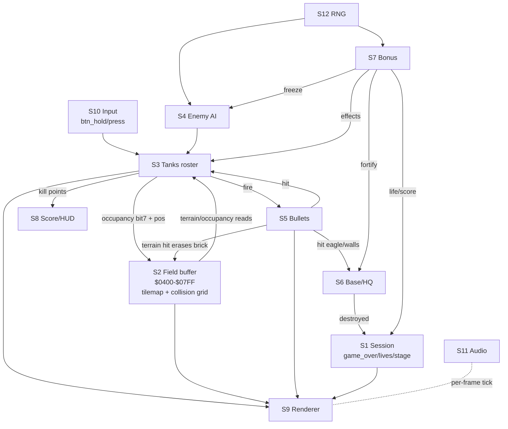

# Battle City — System Interaction Map

*The "big view" for the `tanks_clone` faithful port. Written **before** any
routine porting, per the architecture-first plan. Its job is to describe every
subsystem, how they share state and call each other, and — from that coupling —
propose the JS class decomposition the stub scaffold will follow.*

**Source:** `C:\Z_Temp\NES-Games-Disassembly\Battle City\` (cyneprepou4uk
disassembly). Japanese Namco version, 1985. NROM (mapper 0), one 16 KB PRG bank
`$C000–$FFFF`, one fixed 8 KB CHR ROM. The whole game is `bank_FF.asm`; RAM
labels/xrefs live in `bank_ram.inc`; constants in `bank_val.inc`.

**Citation style:** every claim points at a source label or `$addr`. Lines in
the disasm read `<CDL flags> <fileoffset> <bank:addr>: <bytes> <instruction>`.
I cite by label (`sub_C2E6_main_battle_script`) or CPU address (`$C2E6`).

**Decoded vs inferred:** claims marked **[D]** are read directly from the code.
Claims marked **[?]** are inference (from layout, naming, or BC knowledge) and
must be confirmed when the owning subsystem gets its own `research_*.md`.

---

## 1. The two-halves frame model

The game is a single cooperative loop synced to the PPU by one interrupt. There
is no scheduler and no IRQ (`$FFFE → $C070`, "this game doesn't use IRQ").

- **Main-loop half (logic).** Runs continuously, builds two output buffers in
  RAM during the frame:
  - `ram_oam` at **`$0200–$02FF`** — the sprite/OAM shadow (DMA source).
  - a **PPU write buffer** — queued nametable/tile updates, flushed in vblank.
  Then it calls `sub_D8F6_wait_1_frm` (`$D8F6`) which spins until the NMI has
  fired, i.e. one iteration = one frame.
- **NMI half (render + I/O), `vec_D400_NMI` (`$D400`).** Fires at vblank and does
  all hardware talk, in order **[D]**:
  1. OAM DMA: `$2003=0`, `$4014 = >ram_oam` (page `$02`).
  2. `$2002` read (ack vblank) → `sub_D8FD_write_buffer_to_ppu` (flush tile buffer).
  3. `sub_D50E_set_background_palette` if `ram_bg_palette_id` ≥ 0.
  4. Set `$2000` (base nametable | `$B0`), scroll X=0 / Y=`ram_scroll_Y`, `$2001=$1E` (rendering on).
  5. `sub_D689_read_joy_regs` — **input is sampled here**, into `ram_btn_hold`/`ram_btn_press`.
  6. `sub_DA93_hide_unused_sprites` — clear stale OAM.
  7. `sub_EA7E_sound_driver` — **the sound engine ticks once per frame here**.
  8. `INC ram_frm_cnt_lo` (and `ram_frm_cnt_hi` every 64 frames).

**Port consequence.** In JS the NMI half mostly *dissolves*: OAM DMA + PPU-buffer
flush are hardware plumbing. We keep the *responsibilities* (sample input once
per frame, tick audio once per frame, advance the frame counter, then draw), but
re-express them as a `requestAnimationFrame` tick, not a literal buffer flush.
This is the sanctioned "re-derive the hardware abstraction in our own view"
deviation — the mechanism (logic builds state, render ships it) is preserved.

---

## 2. Top-level flow

```
vec_C070_RESET
  └─ init PPU, clear RAM, palettes
  └─ title-screen + demo loop  (loc_C095 … loc_C0A2)
        ├─ sub_C9C0_title_screen_handler   (I / II player select cursor)
        ├─ sub_C41D_demo_handler           (attract-mode auto-play — reuses the battle loop)
        └─ loc_C0AE_construction_handler   (built-in stage editor)
  └─ game-mode dispatch  tbl_CA69_game_mode_handler
        ├─ 00 → 1 player      (5 enemy slots active: con_max_tanks-2)
        ├─ 01 → 2 players
        └─ 02 → construction
  └─ STAGE LOOP (per mode) — the gameplay heartbeat:
        repeat each frame:
          JSR sub_C2E6_main_battle_script   ; LOGIC pipeline (§3)
          JSR sub_DEA6_tanks_handler        ; DRAW all 8 tanks (state machine, §4)
          JSR sub_D8F6_wait_1_frm           ; sync to NMI
```

`sub_C2E6_main_battle_script` is called from the 1P loop (`$C200`), the 2P loop
(`$C23E`), and the demo loop (`$C429`) — always immediately followed by
`sub_DEA6_tanks_handler` **[D]**. So **logic-then-draw-then-wait** is the fixed
per-frame shape, and the demo/attract mode is literally the same loop with AI
driving the "players."

`sub_C331_prepare_tanks_addresses_and_spawn_players_before_stage` (`$C331`) is
the **stage-entry reset**: clears bullets/tanks, spawns surviving players,
seeds the enemy counters (`ram_enemy_spawn_cnt=$14`=20 enemies/stage),
clears power-up timers, draws the 20 enemy icons, and calls
`sub_E42B_prepare_enemy_tanks_for_stage` **[D]**.

---

## 3. The per-frame battle pipeline (the heart)

`sub_C2E6_main_battle_script` runs these **in this exact order** every frame
**[D]**. The order is a **faithfulness invariant** — even though the OO port
reorganizes the *data*, `Game.update()` must call the subsystems in this
sequence, or behavior drifts (e.g. collisions must run after movement).

| # | Routine (`$addr`) | What it does | Reads | Writes |
|---|---|---|---|---|
| 1 | `sub_E181_ice_detection` (`E181`) | Each tank's pixel pos → field cell; detect ice under players; **mark 2×2 occupancy bit7** in field | tank pos, field `$0400+` | `tank_stage_pos_lo/hi`, `plr_flags` (ice bit7), field bit7 |
| 2 | `sub_DB75_ice_movement` (`DB75`) | Apply ice sliding to tanks flagged on ice | `plr_flags`, tank pos | tank pos |
| 3 | `sub_DBF1_tank_movement` (`DBF1`) | Move every tank: players by input, enemies by AI; terrain-blocked via field | input, tank dir/flags, field | tank pos, tank flags (dir) |
| 4 | `sub_E1FA` (`E1FA`) | **Tank→field occupancy writeback** — set bit7 for each tank's cell footprint (post-move) | tank_stage_pos, field | field bit7 |
| 5 | `sub_E02E_bullets_status_handler` (`E02E`) | Advance bullet lifecycle/status per tank | bullet_status | bullet_status |
| 6 | `sub_E2A9_HQ_handler` (`E2A9`) | Eagle/base: draw, shovel-fortify walls, detect destruction → game over | shovel_timer, field | field, game_over_flag |
| 7 | `sub_E27C_players_invincibility_handler` (`E27C`) | Star/helmet invincibility timers + blink | helmet_timer | tank flags/render |
| 8 | `sub_E122` (`E122`) | **Player fire** — A/B → spawn bullet; 2-bullet upgrade promotes shot to `2nd_bullet` slot | btn_press, tank_type, bullet arrays | bullet arrays (`E08C`) |
| 9 | `sub_E162` (`E162`) | **Enemy fire** — frozen if `clock_timer`≠0; else 1/32 RNG roll per enemy → spawn bullet | clock_timer, tank flags, RNG | bullet arrays (`E08C`) |
| 10 | `sub_DB48_enemy_spawn_handler` (`DB48`) | Spawn next enemy when slot free + interval elapsed | spawn counters, timers | tank slot 2–7 |
| 11 | `sub_E604_bullets_movement` (`E604`) | Move all bullets; terrain collision via field (brick/steel/water) | bullet arrays, field | bullet pos/status, field (brick erase) |
| 12 | `sub_E910_check_bullets_collision_with_bullets` (`E910`) | Bullet-vs-bullet cancellation | bullet arrays | bullet_status |
| 13 | `sub_E70C_check_bullets_collision_with_player_tanks` (`E70C`) | Bullet-vs-tank hits (and enemy bullets vs players) | bullet arrays, tank arrays | tank flags (→explode), score |
| 14 | `sub_E972_try_to_pick_up_bonus` (`E972`) | Player over bonus → apply power-up effect | bonus pos/id, tank pos | bonus, timers, lives, score |
| 15 | `sub_C972_game_over_text_handler` (`C972`) | Slide in GAME OVER when `game_over_flag` set | game_over_flag | render |
| 16 | `sub_DB0B_player_movement_sfx_handler` (`DB0B`) | Engine SFX from whether players are moving | tank move state | sfx regs |
| 17 | `sub_C7C8_print_lives_handler` (`C7C8`) | Lives HUD | lives | PPU buffer |
| 18 | `sub_C31D_water_palette_swap_handler` (`C31D`) | Animate water: swap bg palette every 32 frames | frm_cnt | bg_palette_id |

Note the missing draw step: `sub_DEA6_tanks_handler` (drawing the 8 tanks) is
**not** in this list — it's the *second* call in the stage loop (§2), right after
this pipeline. So this routine is purely "advance world state"; tank drawing is
its own pass.

---

## 4. The tank state machine (dispatch mechanism)

`sub_DEA6_tanks_handler` (`$DEA6`) loops `X = 0..7` calling
`sub_DEB8_tank_handler` per slot **[D]**. `tank_handler` dispatches on the **high
nibble of `ram_tank_flags,X`** through a jump table:

```
tank_handler:  A = tank_flags[X];  Y = (A >> 3) & $FE       ; nibble → word index
               JMP (tbl_E4B8_tank_status_handler + Y)
```

So `ram_tank_flags` packs **state (high nibble) + direction (low nibble)** in one
byte, and the state drives a vectored jump — the cleanest possible thing to port
as method dispatch (a `switch(state)` or a per-state method on `Tank`). Known
states from `bank_val.inc` + the handlers at `$DECD…` **[D]**:

| flags hi | handler | meaning |
|---|---|---|
| `$10` | `ofs_001_DEFD_10_kill_points` | show points popup after a kill |
| `$20`/`$30`/`$40` | `ofs_001_DF33/DF46_..._explosion` | multi-frame explosion animation |
| `$50`/`$60`/`$70` | `ofs_001_DECD_..._explosion` | explosion (con_tank_flag_explosion=`$70`) |
| `$80`–`$A0` | normal active states | alive/driving |
| `$B0`/`$C0`/`$D0` | (con_tank_flag_follow_HQ/p2/p1) | **enemy AI target bias** |
| `$E0` | — | (guard band: `≥$E0` treated as respawning) |
| `$F0` | con_tank_flag_respawn | spawning/blink-in |

The pipeline routines gate on this constantly with the same idiom **[D]**:
`BPL` (bit7 clear) = "exploding/inactive, skip"; `CMP #$E0 / BCS` = "respawning,
skip". So "is this tank live and drivable?" = `flags ≥ $80 && flags < $E0`.

---

## 5. Subsystem catalog

Each subsystem, its role, the state it owns, and its main routines. This is the
raw material the §7 decomposition groups into classes.

**S1 — Session / mode / stage flow.** Owns `ram_game_mode`, `ram_stage`,
`ram_lives` (2), `ram_game_over_flag`, `ram_2nd_loop_flag`, per-player scores.
Routines: reset, `tbl_CA69` mode dispatch, the stage loops, `C331` stage prep,
`C728_check_condition_for_stage_ending`, `CCD4_score_after_stage_handler`.

**S2 — Field / battlefield.** *The central shared structure.* The **field buffer
`$0400–$07FF`** (nametable mirror) holds tile IDs **and** bit7 occupancy. Owns
terrain semantics (brick/steel/water/trees/ice) via `tbl_DACB_block_data`.
Routines: `F000_draw_stage`, `D80B_write_block_tiles_and_attribute_to_buffer`,
`E181` (ice + occupancy), `E1FA` (occupancy writeback), `D706/D709/D713`
(pixel→cell pointer), `E181_..._ice_detection`. Terrain collision for tanks and
bullets is *reads of this buffer*.

**S3 — Tanks (roster).** 8 parallel arrays, `X = slot`: `tank_pos_X`($90),
`_pos_Y`($98), `_flags`($A0), `_type`($A8), `_wheels`($B0),
`tank_stage_pos_lo/hi`($E0/$E8). **Slot 0=P1, 1=P2, 2–7=enemies** **[D]**.
Routines: `DEA6`/`DEB8` (draw+state), `DC3D_tank_status_handler`,
`DBF1_tank_movement`, `DB75_ice_movement`, `E363_tank_spawn_handler`,
`DB48_enemy_spawn_handler`, `E42B_prepare_enemy_tanks_for_stage`,
`E27C_players_invincibility_handler`, `E420_change_tank_status`.

**S4 — Enemy AI.** Not a separate routine block — woven into S3. Targeting bias
lives in the `tank_flags` nibble (`$B0/$C0/$D0` follow HQ/p2/p1); movement
decisions in `DBF1_tank_movement` using `D44D` RNG and
`ram_enemy_destination_X/Y`; firing in `E162` (1/32 roll). Enemy *types/counts*
per stage in `ram_enemy_type_stage_cnt` ($8B, 4 bytes = 4 types) **[?]** and
`E42B`.

**S5 — Bullets.** Per-tank arrays (8 wide) + 2nd bullet (players only, 2 wide)
**[D]**: `bullet_pos_X`($B8)/`_Y`($C2), `bullet_status`($CC),
`bullet_property`($D6); `2nd_*` at `$C0/$CA/$D4/$DE`. Routines: `E08C_bullets`
(spawn), `E02E_bullets_status_handler`, `E604_bullets_movement`,
`E70C` (vs tanks), `E910` (vs bullets), terrain hit inside `E604`,
`DEE2_draw_bullet_explosion`, `E409_clear_bullet_status`.

**S6 — Base / HQ (eagle).** `E2A9_HQ_handler`, `ram_shovel_timer`($45) fortify,
eagle draw routines (`CAF5`/`CB5D`/`CB9E`/`CC08`), destruction → sets
`game_over_flag`. Reads/writes S2 field (the walls around the eagle).

**S7 — Bonus / power-ups.** `ram_bonus_pos_X/Y/id`($86/$87/$88),
`ram_bonus_timer`($62). Effects touch many subsystems: helmet/star
(`ram_helmet_timer` $89), clock/freeze (`ram_clock_timer` $0100 → gates S4 fire),
shovel (S6), grenade/tank/star-upgrade. Routines: `E8BE_spawn_bonus`,
`E23B_display_bonus_on_screen`, `E972_try_to_pick_up_bonus`,
`E902_convert_random_number_to_position`.

**S8 — Score / HUD.** BCD scores `p1_score`($15)/`p2_score`($1D)/`hi_score`($3D),
`com_dec_*` digit fields ($35–$3B). Routines: `D9BE_add_score`,
`D138_gain_extra_life_for_20000_pts`, `D97D_check_hiscore_beaten`,
`C7C8_print_lives_handler`, enemy-icon counter (`C894/C8A2/C8B1/C8C0`),
`CEF7_draw_screen_with_score_count`.

**S9 — Renderer (PPU abstraction).** OAM shadow `$0200`, PPU write buffer,
palettes (`tbl_D555`/`tbl_D565`, `D50E`/`D53E`), scroll `ram_scroll_Y`.
Routines: NMI half, `DA2B_display_sprite`, `DA7B_display_2_sprites`,
`DA93_hide_unused_sprites`, `D8FD_write_buffer_to_ppu`, `D6B3_fill_buffer_with_tiles`,
`D85E`/`D8D2` "huge letter" text, `D771_write_to_ppu`.

**S10 — Input.** `D689_read_joy_regs` (in NMI) → `ram_btn_hold`($06),
`ram_btn_press`($08), 2 bytes each (P1/P2). `E451_convert_Dpad_buttons`
(Dpad → facing direction). Constants `con_btn_*` in `bank_val.inc`.

**S11 — Audio.** Bytecode sound engine: `EA7E_sound_driver` (ticked in NMI)
interprets control bytes (`con_se_cb_*`: loops/stop/main-loop) from sfx data
streams (`_off000_sfx_*` table at `$ED..`). This is *ported code*, not analog
hardware — fully portable, but a good deferral candidate.

**S12 — RNG.** `D44D_generate_random_number`: `random = random*7 + frm_cnt_hi +
zp[++index]` **[D]**. Consumed by S4 (movement, fire), S7 (bonus pos), spawn.

**S13 — Construction (stage editor).** `loc_C0AE_construction_handler` + cursor
movement + block paste + `stage_FF.bin` default. Ships in the retail ROM.
Deferral candidate (not core gameplay).

---

## 6. Coupling — the shared-state graph

The subsystems are coupled almost entirely through **five shared data
structures**. This is what the OO decomposition must respect.



**The five shared structures:**

1. **Field buffer (S2)** — the biggest coupler. It is *simultaneously* the
   tilemap (what's drawn) and the collision grid (bit7 occupancy + tile-type
   terrain). Tank movement, bullet-terrain collision, base walls, and occupancy
   all read/write it. In OO this becomes a central `Field` service that most
   other objects query.
2. **Tank roster (S3)** — read by nearly everyone (collision, AI, bonus, render).
3. **Bullet arrays (S5)** — indexed parallel to tanks (bullet *i* is tank *i*'s).
4. **Session state (S1)** — `game_over_flag`, `lives`, `stage`, scores.
5. **Frame/RNG/input primitives (S10/S12 + `frm_cnt`)** — cross-cutting inputs.

**Ordering couplings (must preserve, §3):** ice-detect → move → occupancy →
fire → spawn → bullet-move → collisions → bonus. Reordering changes behavior.

---

## 7. JS decomposition (idiomatic OO) — **LOCKED 2026-07-15**

Derived from §6, honoring the chosen style: **idiomatic OO, faithful behavior,
data reorganized** (not a zero-page mirror). Each class notes the source routines
it will absorb. Boundaries follow the coupling graph, so a class rarely reaches
into another's data except through the `Field` service (which is *meant* to be
shared). **Locked per Zane 2026-07-15:** build the classes as proposed; if a
boundary proves wrong during implementation, revise then — don't block the
scaffold on it. `Audio` and `Construction` are **stub-only (deferred, low
priority)**. The §8 `[?]` items are resolved during implementation / in the
per-subsystem docs, not before scaffolding.

| JS module / class | Responsibility | Absorbs (source) |
|---|---|---|
| `Game` | mode dispatch, stage loop, `update()` calling subsystems in the §3 order, session state (lives/stage/score/gameOver) | reset, `tbl_CA69`, stage loops, `C331`, `C728`, `CCD4` |
| `Field` | tilemap + collision grid service; terrain types; block data; draw; pixel→cell; occupancy bit7; terrain queries | `F000`, `tbl_DACB`, `D80B`, `E181`, `E1FA`, `D706/D713` |
| `Tank` | one tank: pos/dir/type/state(`flags`)/wheels; movement; the state-machine dispatch; per-tank render state | `DEB8`, `DC3D`, `DBF1`, `DB75`, tank-status handlers `DECD…` |
| `TankRoster` | the 8 slots (0=P1,1=P2,2–7 enemies); the `DEA6` loop; spawn scheduling; invincibility; player/enemy distinction | `DEA6`, `E363`, `DB48`, `E42B`, `E27C` |
| `EnemyAI` | targeting bias (follow HQ/p1/p2), destination pathing, fire decision; delegated to by enemy `Tank`s | `DBF1` (AI paths), `E162`, `ram_enemy_destination_*` |
| `Bullet` / `BulletManager` | per-tank + 2nd-bullet lifecycle; fire; movement; the 3 collision passes; explosion | `E08C`, `E122`, `E02E`, `E604`, `E70C`, `E910`, `DEE2` |
| `Base` | eagle state, shovel fortify walls, destruction → gameOver | `E2A9`, eagle draws, `shovel_timer` |
| `Bonus` | spawn/display/pickup + effect application (helmet/clock/shovel/grenade/tank/star) | `E8BE`, `E23B`, `E972`, `E902` |
| `Score` / `Hud` | BCD score, extra-life, hi-score, lives + enemy-icon HUD | `D9BE`, `D138`, `D97D`, `C7C8`, icon counters |
| `Renderer` | canvas draw of field + sprites + text + palettes; the re-derived "NMI render" responsibilities | NMI half, `DA2B`/`DA7B`, palettes, `D8FD`, huge-text |
| `Input` | joypad state (hold/press, 2 players) + Dpad→direction | `D689`, `E451` |
| `Audio` | bytecode sfx engine (deferral candidate) | `EA7E` + sfx data |
| `Rng` | the `D44D` mixer | `D44D` |
| `Construction` | stage editor (deferral candidate) | `C0AE` + cursor/paste |

**Design notes for the port:**
- `Field` is deliberately a *shared service*, not owned by one entity — that
  matches the source, where the field buffer is the universal collision medium.
  The alternative (hiding cells inside `Tank`/`Bullet`) would fight the source.
- The **§3 pipeline order** becomes the body of `Game.update()`. Keep it literal.
- The **`tank_flags` state machine** becomes a `Tank` state enum + per-state
  handler (mirrors the `tbl_E4B8` jump table).
- The **NMI/PPU buffer** does not survive as-is; `Renderer` draws directly. Input
  sampling + audio tick + frame-counter bump move into the rAF tick, once per
  frame, preserving their once-per-frame semantics.

---

## 8. Open questions / to-verify (before locking §7)

- **[?]** Field cell geometry: play area is a 13×13 grid of 16×16 blocks (each
  block = 2×2 tiles)? Confirm against `F000_draw_stage` + `tbl_DACB_block_data`.
- **[?]** Enemy type model: `ram_enemy_type_stage_cnt` ($8B, 4 bytes) = the 4
  enemy tank types (basic/fast/power/armor) per stage? Confirm in `E42B`.
- **[?]** `tank_type` bit layout: `& $C0 == $40` gates the 2-bullet upgrade
  (seen in `E122`) — decode the full `tank_type` byte (armor levels, speed).
- **[?]** `E02E_bullets_status_handler` vs `E604_bullets_movement` split — which
  owns terrain collision vs status transitions.
- **[?]** Exactly which power-ups exist and their `bonus_id` values (S7).
- The per-subsystem `research_*.md` docs (Field, Tanks+AI, Bullets, Bonus) will
  resolve these; this map intentionally stays at the coupling level.
